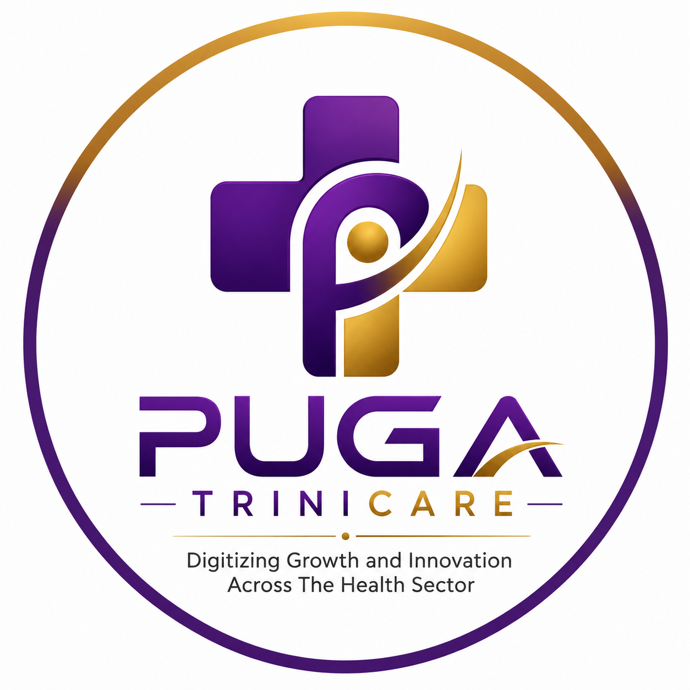
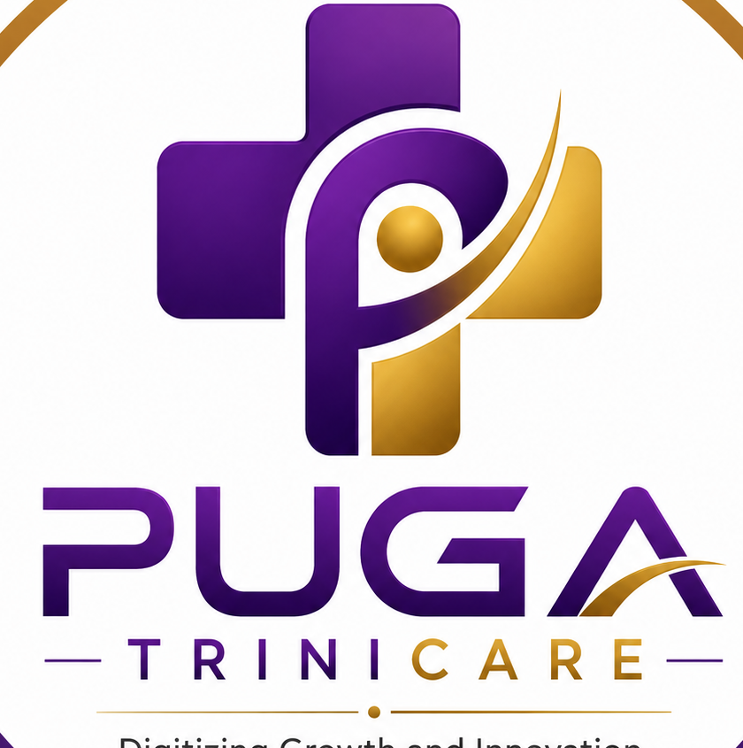

Puga TriniCare

  

  <strong>AI-powered health education, care navigation, and personal health support for everyone.</strong>

  <a href="https://ai.pugatrinicare.com">Live App</a> ·
  <a href="https://pugatrinicare.com">Puga TriniCare</a>

---

About Puga TriniCare

Puga TriniCare is a modern digital health platform designed to make health information, education, care navigation, and personal health support more accessible.

At the heart of the platform is PugaAI, an AI-powered health education assistant designed to help people understand health topics in clear, accessible language while guiding them toward appropriate next steps.

Puga TriniCare is designed with a strong focus on:

- Accessible health education
- AI-assisted health conversations
- Care navigation
- Personal health information
- Health identity
- Family health management
- Appointments and care planning
- Health journeys
- Privacy and controlled access
- Mobile-first digital health experiences
- African and Nigerian healthcare contexts

«Puga TriniCare provides health education and support. It does not replace qualified healthcare professionals, emergency services, diagnosis, or medical treatment.»

---

PugaAI

PugaAI is the intelligent health education layer of Puga TriniCare.

Users can interact with PugaAI to:

- Ask health-related questions
- Learn about symptoms and health conditions
- Understand health terminology
- Explore preventive health information
- Receive general wellness education
- Navigate available care options
- Prepare questions for healthcare professionals
- Explore health topics through conversational interaction
- Use voice-oriented interaction where supported

PugaAI is designed to communicate health information in a way that is understandable and useful while encouraging appropriate professional care when necessary.

---

Supported Languages

Puga TriniCare is designed with multilingual accessibility in mind.

The platform currently provides language options including:

- 🇳🇬 English (Nigeria)
- 🇳🇬 Nigerian Pidgin
- 🇳🇬 Yorùbá
- 🇳🇬 Igbo
- 🇳🇬 Hausa

The language architecture is intended to support the continued expansion of culturally and linguistically appropriate health education.

---

Core Features

🤖 PugaAI Health Assistant

Conversational AI for health education and information.

Users can interact with PugaAI through a simple, lightweight interface designed for mobile, tablet, and desktop experiences.

🩺 Health Education

Provides accessible educational information covering general health, wellness, prevention, symptoms, conditions, and healthcare concepts.

🧭 Care Navigation

Helps users understand possible healthcare pathways and navigate from health questions toward appropriate care resources.

🪪 Health ID

A digital health identity experience designed to help users organize and access their personal health information.

👨‍👩‍👧 Family Health

Supports family-oriented health organization and management.

📅 Appointments

Provides an interface for organizing and interacting with healthcare appointment information.

📈 Health Journey

Designed to help users understand and track their health-related journey over time.

🔐 Privacy & Access

Provides interfaces for privacy controls and controlled access to health information.

🔔 Notifications

Supports health-related notifications and important application updates.

🎙️ Voice Interaction

The application includes interfaces for voice-oriented interaction with PugaAI where supported by the platform.

---

Design Philosophy

Puga TriniCare follows a modern, clean, lightweight, and accessible interface philosophy.

The application is designed to:

- Feel familiar on mobile devices
- Scale naturally to tablets and desktops
- Minimize unnecessary visual complexity
- Keep important actions easy to find
- Use clear typography and spacing
- Provide responsive navigation
- Use dialogs appropriately across screen sizes
- Maintain a consistent visual language
- Keep health information easy to understand

The interface is intentionally designed around the needs of everyday users rather than technical users.

---

Responsive Experience

Puga TriniCare is designed for:

- 📱 Mobile phones
- 📲 Tablets
- 💻 Desktop computers
- 🌐 Modern web browsers

Responsive behavior is implemented throughout the application so that core experiences remain usable across different screen sizes.

---

Technology Stack

Puga TriniCare is built using modern web technologies.

Frontend

- Next.js
- React
- TypeScript
- Tailwind CSS
- shadcn/ui
- Lucide React

Application Platform

- Next.js App Router
- Client-side React interactions
- Responsive web application architecture
- Progressive web application assets
- Vercel-compatible deployment architecture

Package Management

The project uses pnpm.

---

Project Structure

puga-health/
├── app/
│   ├── page.tsx
│   ├── globals.css
│   └── ...
│
├── components/
│   └── ...
│
├── lib/
│   └── utils.ts
│
├── public/
│   ├── puga-trinicare-official.png
│   ├── puga-trinicare-compact.png
│   ├── icon.svg
│   ├── icon-192.png
│   ├── apple-icon.png
│   └── ...
│
├── next.config.mjs
├── package.json
├── pnpm-lock.yaml
├── pnpm-workspace.yaml
├── postcss.config.mjs
├── components.json
└── tsconfig.json

---

Getting Started

Prerequisites

Make sure you have the following installed:

- Node.js
- pnpm
- Git

Clone the repository

git clone https://github.com/ctopomari/puga-health.git
cd puga-health

Install dependencies

pnpm install

Start the development server

pnpm dev

The application will normally be available at:

http://localhost:3000

---

Production Build

Create a production build with:

pnpm build

Start the production application with:

pnpm start

---

Development

For local development:

pnpm dev

The application uses the Next.js development environment with hot reloading.

Changes made to application files should automatically appear during development.

---

Environment Variables

Environment variables should be stored in a local environment file and should never be committed with private credentials.

Create:

.env.local

Example:

# Add application-specific environment variables here.

Only expose variables to the browser when they are intentionally prefixed according to the framework's public environment-variable conventions.

---

Health & Safety

Puga TriniCare is intended to support health education and navigation.

Information provided through the platform should not be interpreted as:

- A medical diagnosis
- A prescription
- A substitute for a doctor
- A substitute for a qualified healthcare professional
- Emergency medical care

Users experiencing a medical emergency should contact appropriate emergency services or seek immediate professional medical attention.

For important health decisions, users should consult a qualified healthcare professional.

---

Privacy

Health information is sensitive.

Puga TriniCare is designed with privacy and controlled access as important parts of the product experience.

Development and production implementations should follow applicable privacy, security, data-protection, and healthcare requirements.

Do not place:

- API keys
- Passwords
- Authentication secrets
- Private tokens
- Database credentials
- Private certificates
- Other sensitive credentials

inside the repository.

---

Security

If you discover a security vulnerability in Puga TriniCare, please avoid publicly exposing sensitive details before the issue can be responsibly addressed.

When reporting a security issue, include enough information to reproduce the problem without exposing personal health information or other confidential data.

---

Accessibility

Puga TriniCare aims to make health technology accessible to a broad range of users.

The application emphasizes:

- Readable typography
- Clear controls
- Responsive layouts
- Accessible interactive elements
- Appropriate contrast
- Keyboard-friendly interfaces where applicable
- Mobile-friendly touch targets
- Simple navigation
- Clear health-information presentation

Accessibility remains an ongoing area of improvement.

---

Branding

The official Puga TriniCare branding assets are maintained inside:

/public

Primary brand assets include:

public/puga-trinicare-official.png
public/puga-trinicare-compact.png
public/icon.svg
public/icon-192.png
public/apple-icon.png

These assets should be reused instead of recreating or replacing the official Puga TriniCare identity.

---

Product Architecture

Puga TriniCare is structured as a modular digital health experience.

The platform is intended to evolve through multiple layers:

                    PUGA TRINICARE
                          │
              ┌───────────┴───────────┐
              │                       │
           PugaAI                Health Platform
              │                       │
       ┌──────┼──────┐        ┌───────┼────────┐
       │      │      │        │       │        │
     Chat   Voice  Education  Health  Family  Care
                               ID     Health  Navigation
                                      │
                              ┌───────┴───────┐
                              │               │
                         Appointments    Health Journey

The architecture is intended to allow additional health services and integrations to be introduced without redesigning the core user experience.

---

AI Health Education Principles

PugaAI is designed around several principles:

Clarity

Health information should be understandable to ordinary users.

Accessibility

Health education should be available through simple digital experiences.

Context

Health information should consider the user's question and conversational context.

Safety

The system should avoid presenting general health information as a definitive diagnosis or treatment plan.

Human Care

AI should support — not replace — healthcare professionals and human care.

Local Relevance

Puga TriniCare is designed with Nigerian and African users in mind, including support for local languages and healthcare contexts.

---

Roadmap

Puga TriniCare is an evolving platform.

Potential areas of continued development include:

- Expanded multilingual health education
- Improved AI health conversations
- More voice capabilities
- Health record organization
- Enhanced Health ID functionality
- Family health improvements
- Healthcare-provider connectivity
- Appointment integrations
- Care navigation improvements
- Health reminders
- Personalized health journeys
- Progressive web application capabilities
- Native mobile application capabilities
- Additional healthcare integrations
- Improved accessibility
- Expanded privacy and security controls

The roadmap may change as the platform develops and user needs are evaluated.

---

Deployment

Puga TriniCare is compatible with modern Next.js hosting environments.

The application can be deployed using platforms such as Vercel or other infrastructure capable of hosting Next.js applications.

Production deployments should ensure that:

1. Required environment variables are configured.
2. Sensitive credentials are stored securely.
3. Production builds complete successfully.
4. Authentication and data access are appropriately protected.
5. Health and personal data are handled according to applicable requirements.
6. HTTPS is enabled.
7. Monitoring and error reporting are configured appropriately.

---

Contributing

Contributions and improvements should preserve the core principles of Puga TriniCare.

When making changes:

1. Preserve existing functionality unless the change explicitly requires modification.
2. Keep the interface responsive.
3. Avoid unnecessary dependencies.
4. Follow the existing project structure.
5. Maintain TypeScript correctness.
6. Keep health-related language clear and responsible.
7. Avoid exposing sensitive information.
8. Test important user flows before deployment.

---

License & Ownership

© 2026 Puga Digital Technologies. All rights reserved.

Puga TriniCare and associated branding, product concepts, visual assets, application interfaces, and proprietary materials are owned by Puga Digital Technologies, except where third-party components or licenses explicitly state otherwise.

Third-party libraries and dependencies remain subject to their respective licenses.

This repository should not be interpreted as granting permission to copy, redistribute, rebrand, commercially exploit, or reproduce proprietary Puga TriniCare materials without appropriate authorization.

---

Trademark & Brand Notice

Puga TriniCare™ is a product of Puga Digital Technologies.

The names, logos, visual identity, product interfaces, and associated branding are intended to identify the Puga TriniCare product and its services.

Unauthorized use of the Puga TriniCare brand or official logo may create confusion regarding the source or affiliation of a product or service.

---

Official Product

Puga TriniCare

AI-powered health education and digital health support.

Built by Puga Digital Technologies

🌐 https://ai.pugatrinicare.com

---

  

  <strong>Puga TriniCare</strong> 
  Health education. Care navigation. Digital health support.

  © 2026 Puga Digital Technologies. All rights reserved.

